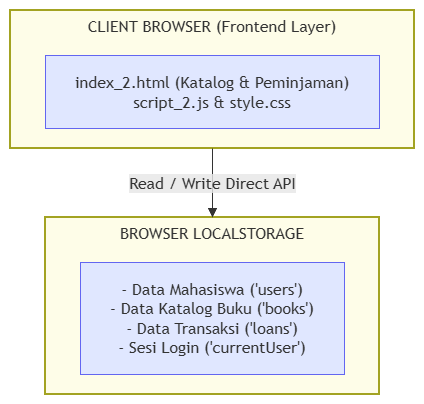
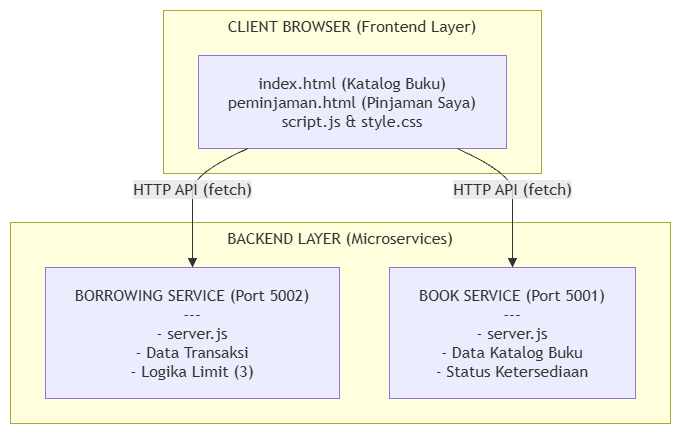
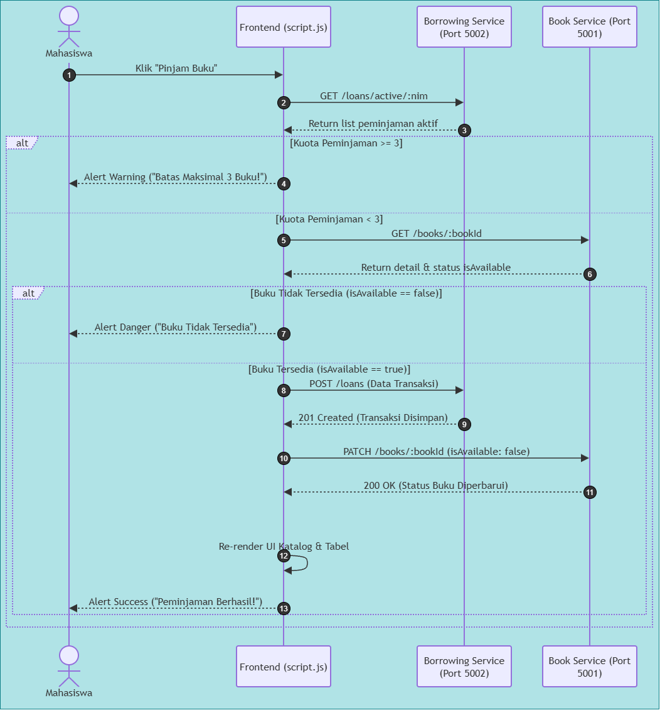
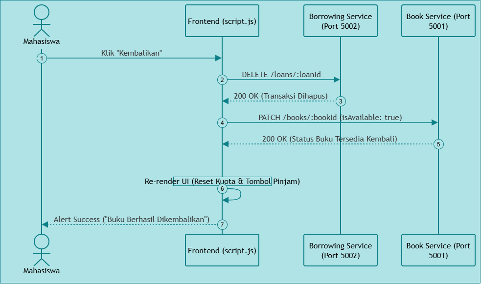

1. Arsitektur Sebelum Dikembangkan
  Pada tahap awal, sistem masih menggunakan arsitektur client-side sederhana. Seluruh komponen aplikasi berjalan pada browser dan terdiri dari halaman utama, file JavaScript, serta file CSS. Proses pengelolaan data dilakukan secara langsung menggunakan Browser LocalStorage.

  File script.js menangani sebagian besar proses utama aplikasi, seperti pengelolaan data mahasiswa, katalog buku, transaksi peminjaman, pengembalian buku, serta sesi pengguna yang sedang login. Data tersebut disimpan pada localStorage, sehingga frontend menjadi bagian yang menangani antarmuka sekaligus logika dan penyimpanan data.

  Dengan demikian, pada tahap awal sistem belum menggunakan backend service maupun REST API. Komunikasi antara antarmuka dan data dilakukan secara langsung melalui browser.

  Secara arsitektur, sistem pada tahap awal dapat dilihat pada diagram berikut.
  

  Berdasarkan diagram tersebut, pengguna berinteraksi dengan Client Browser (Frontend Layer). Frontend kemudian melakukan proses Read/Write terhadap Browser LocalStorage. Data yang disimpan meliputi data mahasiswa (users), data katalog buku (books), data transaksi (loans), serta sesi pengguna yang sedang login (currentUser).

  Arsitektur ini menunjukkan bahwa proses aplikasi masih terpusat pada sisi client karena frontend menangani hampir seluruh proses sistem.

2. Arsitektur Sesudah Dikembangkan
  Pada tahap pengembangan, sistem mengalami perubahan dengan memisahkan frontend dan backend. Backend kemudian dibagi menjadi dua service, yaitu Book Service dan Borrowing Service. Frontend tetap berjalan pada browser dan terdiri dari index.html sebagai halaman katalog buku, peminjaman.html sebagai halaman pinjaman mahasiswa, script.js untuk menangani interaksi dan komunikasi dengan backend, serta style.css untuk mengatur tampilan aplikasi.

  Pada sisi backend, Book Service berjalan pada port 5001 dan bertanggung jawab untuk mengelola katalog serta status ketersediaan buku. Sementara itu, Borrowing Service berjalan pada port 5002 dan bertanggung jawab terhadap transaksi peminjaman dan pengembalian buku.

  Komunikasi antara frontend dan kedua service dilakukan menggunakan HTTP REST API dengan fungsi fetch() dan pertukaran data dalam format JSON. Kedua service juga menggunakan CORS agar permintaan dari frontend yang berjalan pada port berbeda dapat diterima oleh backend.

  Struktur arsitektur setelah pengembangan dapat dilihat pada diagram berikut.
  

  Berdasarkan diagram tersebut, frontend berkomunikasi dengan dua backend service. Book Service digunakan untuk mengambil data buku serta mengubah status ketersediaannya, sedangkan Borrowing Service digunakan untuk mengelola transaksi peminjaman dan pengembalian.

  Selain komunikasi dengan frontend, terdapat komunikasi antar-service. Borrowing Service dapat berkomunikasi dengan Book Service untuk memeriksa ketersediaan buku dan memperbarui status buku ketika terjadi peminjaman maupun pengembalian. Kedua service berjalan secara terpisah pada port 5001 dan 5002, sehingga masing-masing memiliki tanggung jawab yang lebih spesifik.
  
  Pembagian tanggung jawabnya adalah sebagai berikut:
  |Komponen	                   |Fungsi                                                          |
  |Frontend	                   |Menampilkan katalog buku dan halaman peminjaman serta menangani |  
  |                            |interaksi pengguna                                              |
  |Book Service :5001	         |Mengelola data katalog buku dan status ketersediaan buku        |
  |Borrowing Service :5002	   |Mengelola data dan proses transaksi peminjaman                  |
  |REST API	                   |Menjadi media komunikasi antara frontend dan backend service    |
  |Komunikasi antar-service	   |Memungkinkan Borrowing Service berkomunikasi dengan Book Service|

  Pada proses peminjaman, Borrowing Service juga berkomunikasi dengan Book Service untuk mendapatkan informasi buku dan memperbarui status ketersediaannya. Hal tersebut menunjukkan adanya komunikasi antar-service dalam arsitektur yang dikembangkan.

3. Perubahan Utama Arsitektur
  Perubahan utama pada sistem terletak pada pemisahan tanggung jawab serta mulai dipindahkannya sebagian proses dari frontend ke backend service. Pada tahap awal, proses aplikasi masih terpusat pada frontend dan data disimpan menggunakan localStorage. Setelah dikembangkan, sistem mulai menggunakan beberapa backend service yang memiliki tanggung jawab berbeda.

  Perubahan tersebut dapat diringkas sebagai berikut:
  | Aspek                   | Tahap Awal                  | Tahap Pengembangan                   |
  |---                      |---                          |---                                   |
  | Arsitektur              | Client-side terpusat        | Frontend + backend service           |
  | Struktur                | Frontend dalam satu aplikasi| Frontend, Book Service, dan Borrowing|
  |                         |                             | Service                              |
  | Penyimpanan             | Browser LocalStorage        | Mulai melibatkan backend service     |
  | Backend                 | Belum tersedia              | Node.js + Express                    |
  | API                     | Tidak menggunakan REST API  | Menggunakan HTTP REST API            |
  | Pengelolaan Buku        | `script.js`                 | Book Service                         |
  | Pengelolaan Peminjaman  | `script.js`                 | Borrowing Service |
  | Pengelolaan Pengembalian| `script.js`                 | Ditangani melalui Borrowing Service  |
  | Komunikasi Antar-Service| Tidak ada                   | Ada antara Borrowing Service dan Book|
  |                         |                             | Service                              |
  | Halaman Peminjaman      | Terintegrasi pada halaman utama | Dipisahkan menjadi               |
  |                         |                                 | `peminjaman.html`                |

  Fitur pengembalian buku sudah tersedia pada tahap awal. Oleh karena itu, pengembangan yang dilakukan bukan menambahkan fitur pengembalian dari awal, tetapi memindahkan dan mengembangkan implementasinya agar dapat ditangani oleh bagian backend yang sesuai.

4. Sequence Diagram Peminjaman Buku
  Setelah melihat perubahan arsitektur, proses peminjaman buku dapat dijelaskan melalui sequence diagram berikut.

  

  Berdasarkan diagram tersebut, proses peminjaman dimulai ketika mahasiswa menekan tombol “Pinjam Buku” pada frontend. Frontend kemudian meminta daftar peminjaman aktif kepada Borrowing Service untuk memeriksa batas maksimal peminjaman.

  Jika jumlah buku aktif sudah mencapai 3 buku, sistem menampilkan peringatan kepada mahasiswa. Jika jumlah buku masih di bawah batas tersebut, frontend meminta detail buku kepada Book Service untuk memeriksa status ketersediaannya.

  Jika buku tidak tersedia, sistem menampilkan peringatan bahwa buku sedang tidak tersedia. Jika buku tersedia, frontend mengirimkan data peminjaman kepada Borrowing Service. Setelah transaksi berhasil disimpan, Borrowing Service mengembalikan respons keberhasilan kepada frontend.

  Selanjutnya, frontend mengirimkan permintaan kepada Book Service untuk mengubah status buku menjadi tidak tersedia. Setelah status berhasil diperbarui, antarmuka diperbarui kembali dan sistem menampilkan notifikasi bahwa peminjaman berhasil.

5. Sequence Diagram Pengembalian Buku
  Proses pengembalian buku kemudian dapat dijelaskan melalui sequence diagram berikut.

  

  Diagram tersebut menunjukkan alur komunikasi antara mahasiswa, frontend, Borrowing Service, dan Book Service ketika proses pengembalian buku dilakukan.

  Proses pengembalian dimulai ketika mahasiswa memilih buku yang ingin dikembalikan melalui halaman peminjaman. Permintaan tersebut kemudian dikirimkan oleh frontend kepada Borrowing Service untuk diproses sebagai transaksi pengembalian.

  Setelah transaksi berhasil diproses, Borrowing Service berkomunikasi dengan Book Service untuk memperbarui status buku. Status buku yang sebelumnya tidak tersedia kemudian diubah menjadi tersedia.

  Setelah proses selesai, frontend memperbarui daftar peminjaman sehingga buku yang telah dikembalikan tidak lagi ditampilkan sebagai buku yang sedang dipinjam.

  Dari alur tersebut dapat dilihat bahwa Borrowing Service bertanggung jawab terhadap transaksi peminjaman dan pengembalian, sedangkan Book Service bertanggung jawab terhadap data buku dan status ketersediaannya.

6. Kesimpulan Perubahan Arsitektur
  Berdasarkan perbandingan arsitektur dan sequence diagram, sistem mengalami perubahan dari arsitektur client-side yang terpusat menjadi arsitektur yang mulai memisahkan frontend dan backend ke dalam beberapa service.

  Pada tahap awal, frontend menangani sebagian besar proses aplikasi dan menggunakan localStorage sebagai tempat penyimpanan data. Setelah pengembangan, tanggung jawab sistem mulai dibagi menjadi Book Service dan Borrowing Service yang berkomunikasi melalui REST API.

  Book Service berfokus pada pengelolaan katalog dan status ketersediaan buku, sedangkan Borrowing Service berfokus pada transaksi peminjaman dan pengembalian. Selain itu, terdapat komunikasi antar-service ketika proses peminjaman atau pengembalian membutuhkan pemeriksaan maupun perubahan status buku.

  Namun, pada implementasi frontend yang tersedia, beberapa pengelolaan data masih menggunakan localStorage. Oleh karena itu, kondisi tersebut lebih tepat dipandang sebagai tahap transisi menuju arsitektur service/microservices, bukan implementasi microservices yang sudah sepenuhnya terintegrasi.

  Secara keseluruhan, pengembangan ini membuat struktur sistem menjadi lebih terorganisasi karena tanggung jawab pengelolaan buku dan transaksi mulai dipisahkan ke dalam service yang berbeda.